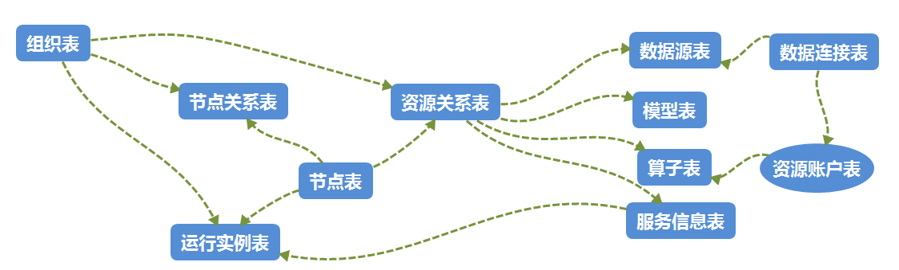
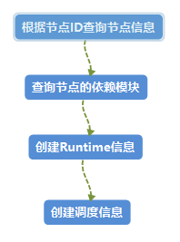

# Atom产品使用文档

## 一、介绍

Atom是一个为AI服务的可编排自动化运行平台，能够在该平台上运行多种算子。具有以下特性：

- 能够自动运行训练、推理、特征和数据算子，以及算子本地开发等，在训练完成后会自动启动推理服务
- 支持文件算子（超大文件预下载与并行下载，多个算子需要同一个文件，重复下载非常浪费资源与时间）
- 提供基于python实现能做基本数据操作的数据算子
- 支持算子本地开发
- 多租户下 kubernetes深度管理
- 支持多种调用（k8s,简单）与运行模式（命令启动，docker）
- 可以从各种数据源（MySQL，Ceph，hbase.....）读取数据给算子提供“养料”，并且把算子产生的数据写入各种存储
- 可操作，可视，支持多租户的控制台
- 可对算子，连接，数据源，模型等进行深度管理

## 二、模块介绍

**atom-python-runtime：**算子运行模块，能够运行各种算子，使用python语言开发

**atom-schedule：**调度模块，支持本地调度与kubernetes调度

**atom-sdk：**SDK模块，对外提供调用接口

**atom-service：**各种业务模块，包括算子服务、用户服务等

**docker：**docker模块，包括dockerfile和kubernetes的yaml配置文件模板

## 三、快速启动

#### 1、在Nacos中添加如下两个配置文件

###### operator-provider-dev

```yaml
spring:
  datasource:
    name: lamp-atom
    url: jdbc:mysql://{mysql_ip}:{port}/atom?useSSL=false&useUnicode=true&characterEncoding=utf-8&allowMultiQueries=true&zeroDateTimeBehavior=convertToNull&allowPublicKeyRetrieval=true
    username: {username}
    password: {password}
    # using druid data source
    type: com.alibaba.druid.pool.DruidDataSource
    maxActive: 20
    initialSize: 1
    maxWait: 60000
    minIdle: 1
    timeBetweenEvictionRunsMillis: 60000
    minEvictableIdleTimeMillis: 300000
    validationQuery: select 'x'
    testWhileIdle: true
    testOnBorrow: false
    testOnReturn: false
    poolPreparedStatements: true
    maxOpenPreparedStatements: 20
    # encrypt password
    filters: config,stat,slf4j

dubbo:
  scan:
    base-packages: com.lamp.atom.service.operator.provider.service.impl
  application:
    name: lamp-atom-service-operator
    owner: dome
    logger: slf4j
  protocol:
    name: dubbo
    port: 20880
    accesslog: true
  provider:
    timeout: 30000
    retries: 0
  registry:
    address: nacos://{nacos_ip}:{port}
    parmeters:
      namespace: atom-dev
    register: true
    subscribe: false

mybatis:
  checkConfig-location : false
  configuration:
    useGeneratedKeys: true
    mapUnderscoreToCamelCase: true
    name: atom-service-operator-provider

pagehelper:
  helperDialect: mysql
  reasonable: true
  supportMethodsArguments: true
  params: count=countSql
```

######  operator-consumer-dev

```yaml
spring:
  application:
    name: lamp-atom-service-operator
    owner: dome
    logger: slf4j
    name: atom-service-operator-consumer

dubbo:
  protocol:
    name: dubbo
    port: 20880
    accesslog: true
  consume:
    timeout: 30000
    retries: 0
  registry:
    address: nacos://{nacos_ip}:{port}
    parmeters:
      namespace: atom-dev
    register: true
    subscribe: true
  scan:
    base-packages: com.lamp.atom.service.operator.consumer.controller

atom:
    schedule:
      operatorScheduleConfig:
        operatorScheduleKubernetesConfig:
          isUser: true
          masterUrl: https://{kubernetes_ip}:{port}/
          configName: kubernetesConfig.yaml
        operatorScheduleRpcConfig:
          namespace: atom-dev
          serverAddr: {nacos_ip}:{port}

decoration:
   defaultExceptionResult: com.lamp.atom.service.operator.consumers.utils.AtomConsumerExceptionResult
```

#### 2、启动算子模块的生产者

```java
com.lamp.atom.service.operator.provider.AtomServiceOperatorProviderApplication.java
```

#### 3、启动算子模块的消费者

```java
com.lamp.atom.service.operator.consumer.AtomServiceOperatorConsumerApplication.java
```

#### 4、启动python的runtime服务

启动atom-runtime-python模块的main.py

## 四、算子模块各部分的依赖关系

#### 1、各部分的关联关系



#### 2、模块创建

##### 数据源

接口：

POST:/lamp/atom/service/operator/dataSource/insertDataSource

参数：

| 参数                 | 类型                  | 是否必须 | 备注                                                         |
| -------------------- | --------------------- | -------- | ------------------------------------------------------------ |
| spaceId              | Long                  | 是       | 空间ID                                                       |
| connectionId         | Long                  | 是       | 连接ID                                                       |
| connectionName       | String                | 是       | 连接名                                                       |
| sourceName           | String                | 是       | 数据源名                                                     |
| sourceType           | Enum("INPUT","OUTPUT) | 是       | 数据源类型                                                   |
| sourceSpace          | String                | 是       | 源登录空间：关系型数据库的数据库，oss的bucket,redis的index,es的index |
| sourceConf           | String                | 是       | 数据源配置                                                   |
| taskInitExecute      | String                | 是       | 初始化                                                       |
| operateExecuteBefore | String                | 是       | 任务开始                                                     |
| dataExecuteBefore    | String                | 是       | 数据执行之前                                                 |
| operateExecute       | String                | 是       | 执行内容                                                     |
| dataExecuteAfter     | String                | 是       | 数据执行之后                                                 |
| operateExecuteAfter  | String                | 是       | 任务结束                                                     |
| dataFormat           | String                | 是       | 数据格式                                                     |
| operatorReadNum      | Integer               | 是       | 算子从source 一次读取数量                                    |
| connectReadNum       | Integer               | 是       | 从连接中一次读取数据量                                       |
| disposable           | Boolean               | 是       | source从connect是否一次行读取                                |
| paginateReadNum      | Integer               | 是       | 分页加载数量                                                 |
| asyncLoad            | Boolean               | 是       | 是否异步从connect读取数据                                    |
| order                | Integer               | 是       | 排序                                                         |

##### 连接

接口：

POST:/lamp/atom/service/operator/connection/insertConnection

参数：

| 参数            | 类型                                          | 是否必须 | 备注                                                         |
| --------------- | --------------------------------------------- | -------- | ------------------------------------------------------------ |
| spaceId         | Long                                          | 是       | 空间ID                                                       |
| operationType   | String                                        | 是       | 算子类型                                                     |
| connectName     | String                                        | 是       | 运行参数                                                     |
| connectType     | Enum("FILE","MYSQL","REDIS","S3","ALIYUNOSS") | 是       | 数据源类型                                                   |
| connectAddr     | String                                        | 是       | 源数据地址                                                   |
| connectAccount  | String                                        | 是       | 源登录账户                                                   |
| connectPassword | String                                        | 是       | 源登录密码                                                   |
| connectSpace    | String                                        | 是       | 源登录空间：关系型数据库的数据库，oss的bucket,redis的index,es的index |
| mode            | String                                        | 是       | 模式                                                         |
| colonyType      | Enum("SINGLE","GROUP")                        | 是       | 集群模式                                                     |
| sourceConf      | JSON                                          | 是       | 源数据配置                                                   |
| sourceRoute     | String                                        | 是       | 源数据路径                                                   |
| sourceSize      | String                                        | 是       | 源数据大小                                                   |
| sourceCount     | Long                                          | 是       | 源数据条数                                                   |

##### 模型

接口：

POST:/lamp/atom/service/operator/model/insertModel

参数：

| 参数                | 类型                                             | 是否必须 | 备注         |
| ------------------- | ------------------------------------------------ | -------- | ------------ |
| spaceId             | Long                                             | 是       | 空间ID       |
| nodeId              | Long                                             |          | 节点ID       |
| runtimeId           | Long                                             | 是       | 运行实例ID   |
| operatorId          | Long                                             | 是       | 训练ID       |
| modelCreateType     | Enum("DATA","TRAIN","REASON","FEATURE","UPLOAD") | 是       | 模型创建类型 |
| modelName           | String                                           | 是       | 模型名       |
| modelVersion        | String                                           | 是       | 模型版本名   |
| modelScore          | Long                                             | 是       | 模型打分     |
| modelType           | Enum("PRE_TRAINING","TERMINAL","USER","COMMON")  | 是       | 模型类型     |
| modelTechnologyType | Enum("MULTI_MODE","NLP")                         | 是       | 模型工程类型 |
| modelAddress        | String                                           | 是       | 模型地址     |
| modelStatus         | String                                           | 是       | 模型状态     |
| connectId           | Long                                             | 是       | 连接id       |
| connectStatus       | String                                           | 是       | 连接状态     |
| operatorResult      | Enum("CONTAIN_OPTIMAL","NOT_CONTAIN_OPTIMAL")    | 是       | 训练结果     |
| resourceType        | String                                           | 是       | 资源类型     |
| resourceValue       | String                                           | 是       | 资源值       |
| resourceSize        | String                                           | 是       | 资源大小     |
| produceWay          | String                                           | 是       | 产生方式     |

##### 算子

接口：

POST:/lamp/atom/service/operator/operator/insertOperator

参数：

| 参数                 | 类型                                                         | 是否必须 | 备注         |
| -------------------- | ------------------------------------------------------------ | -------- | ------------ |
| spaceId              | Long                                                         | 是       | 空间ID       |
| operatorTemplateId   | Long                                                         | 是       | 算子模板     |
| operatorName         | String                                                       | 是       | 算子名       |
| operatorSourceId     | Long                                                         | 是       | 算子源ID     |
| operatorSourceType   | Enum("CUSTOM","SYSTEM","OTHER")                              | 是       | 算子来源类型 |
| operatorRuntimeType  | Enum("TRAIN","REASONING","FEATURES","PYTHON","FLINK","PY_FLINK","ALINK","PYTHON_DATA") | 是       | 算子类型     |
| operatorModel        | Enum("OFFLINE",“REALTIME”，“NEAR_REALTIME”)                  | 是       | 算子运行模式 |
| level                | Integer                                                      | 是       | 细化级别     |
| resourcesAccountId   | Long                                                         | 是       | 资源账户id   |
| codeMode             | String                                                       | 是       | 加载模式     |
| codeAddress          | String                                                       | 是       | 加载地址     |
| codeVersion          | String                                                       | 是       | 代码版本     |
| moduleName           | String                                                       | 是       | 模块名       |
| executeObject        | String                                                       | 是       | 执行对象     |
| operatorConf         | String                                                       | 是       | 算子配置     |
| environmentConf      | String                                                       | 是       | 算子环境配置 |
| modelConf            | String                                                       | 是       | 模型配置     |
| operatorEpoch        | Integer                                                      | 是       | 训练轮数     |
| operatorPlanRuntimes | String                                                       | 是       | 训练预计时长 |
| operatorPriority     | Integer                                                      | 是       | 训练优先级   |
| deployType           | Enum("NOT_DEPLOY","TOUCH_DEPLOY","GREY_DEPLOY","AUTO_DEPLOY") | 是       | 部署类型     |

##### 服务信息

接口：

POST:/lamp/atom/service/operator/serviceInfo/insertServiceInfo

参数：

| 参数             | 类型                         | 是否必须 | 备注                    |
| ---------------- | ---------------------------- | -------- | ----------------------- |
| spaceId          | Long                         | 是       | 空间ID                  |
| siName           | String                       | 是       | 服务名                  |
| siType           | String                       | 是       | 服务类型                |
| siRuntimePattern | Enum("COMMAND","KUBERNETES") | 是       | 服务运行模式            |
| siNodeNum        | Integer                      | 是       | 节点数量                |
| siImageName      | String                       | 是       | 镜像名                  |
| siCpu            | Integer                      | 是       | 服务cpu配置量           |
| siGpu            | Integer                      | 是       | 服务gpu配置量           |
| siMemory         | Integer                      | 是       | 服务内存配置量，单位是M |
| siDisplayMemory  | Integer                      | 是       | 服务现存配置量          |
| siLabel          | String                       | 是       | 服务标签                |

##### 节点

接口：

POST:/lamp/atom/service/operator/node/insertNode

参数：

| 参数                | 类型                                                         | 是否必须 | 备注         |
| ------------------- | ------------------------------------------------------------ | -------- | ------------ |
| spaceId             | Long                                                         | 是       | 空间ID       |
| nodeTemplateId      | Long                                                         | 是       | 节点模板     |
| nodeName            | String                                                       | 是       | 节点名       |
| operatorSourceType  | Enum("CUSTOM","SYSTEM","OTHER")                              | 是       | 算子来源类型 |
| operatorRuntimeType | Enum("TRAIN","REASONING","FEATURES","PYTHON","FLINK","PY_FLINK","ALINK","PYTHON_DATA") | 是       | 算子类型     |
| nodeModel           | Enum("OFFLINE","REALTIME",“NEAR_REALTIME”)                   | 是       | 算子运行模式 |
| nodeEpoch           | Integer                                                      | 是       | 执行次数     |
| nodePlanRuntimes    | String                                                       | 是       | 训练预计时长 |
| nodeStatus          | Enum("CREATE","EDITING","EDIT_FINISH")                       | 是       | 节点状态     |
| operatorPriority    | Integer                                                      | 是       | 训练优先级   |

#### 3、绑定关系

创建节点与静态表的关系：对于每个节点，应该选择需要绑定的数据源、模型、算子、基本服务配置以及最大服务配置和最小服务配置。

接口：

POST:/lamp/atom/service/operator/node/createNodeRelation

参数：

| 参数             | 类型 | 是否必须 | 备注           |
| ---------------- | ---- | -------- | -------------- |
| nodeId           | Long | 是       | 节点ID         |
| nextNodeId       | Long | 否       | 下一个节点ID   |
| operatorId       | Long | 是       | 算子ID         |
| dataSourceId     | Long | 是       | 数据源ID       |
| modelID          | Long | 是       | 模型ID         |
| serviceInfoId    | Long | 是       | 服务配置ID     |
| maxServiceInfoId | Long | 是       | 最大服务配置ID |
| minServiceInfoId | Long | 是       | 最小服务配置ID |

## 五、启动任务

接口：

POST:/lamp/atom/service/operator/taskEvent/startNodeTask

参数：

| 参数                | 类型                                                         | 是否必须 | 备注          |
| ------------------- | ------------------------------------------------------------ | -------- | ------------- |
| taskId              | Long                                                         | 是       | 实验ID/节点ID |
| envs                | Map<String,String>                                           | 否       | 环境参数      |
| operatorRuntimeType | Enum("TRAIN","REASONING","FEATURES","PYTHON","FLINK","PY_FLINK","ALINK","PYTHON_DATA") | 是       | 算子类型      |
| runParameter        | Map<String,String>                                           | 否       | 运行参数      |

启动训练算子流程：



## 六、启动算子

#### 1、训练算子

在启动任务中，当算子类型为训练时，则会调用Python端代码运行训练算子，也可以直接调用该接口。训练后会保存结果集，根据配置的链接保存到MySQL或OSS中。

接口：

POST:/operator/create_operators

参数：

| 参数              | 类型                     | 是否必须 | 备注         |
| ----------------- | ------------------------ | -------- | ------------ |
| sourceAndConnects | List\<SourceAndConnect\> | 是       | 数据源和连接 |
| modelTo           | ModelEntity              | 是       | 模型         |
| resourceAccountTo | ResourceAccountEntity    | 是       | 资源关系     |
| operatorTo        | OperatorEntity           | 是       | 算子         |
| modelConnect      | ConnectionEntity         | 是       | 连接         |

示例参数：

```yaml
{
	"modelConnect":{"id":9,"colonyType":"SINGLE","createTime":1648133297000,"deleteFlag":0,"mode":"string","operationType":"string","connectAccount":"lampup","connectPassword":"Lampup@123","connectAddr":"120.78.148.188","connect_port":3306,"sourceConf":{},"sourceCount":0,"connectName":"string","sourceRoute":"string","sourceSize":"10","connectSpace":"atom","connectType":"MYSQL","spaceId":1,"updateTime":1648636277000},
	"modelTo":{"id":23,"connectId":9,"connectStatus":"connected","createTime":1648133455000,"deleteFlag":0,"modelAddress":"string","modelCreateType":"TRAIN","modelName":"string","modelScore":0,"modelStatus":"string","modelTechnologyType":"MULTI_MODE","modelType":"PRE_TRAINING","modelVersion":"string","nodeId":0,"operatorId":14,"operatorResult":"CONTAIN_OPTIMAL","produceWay":"string","resourceSize":"string","resourceType":"string","resourceValue":"string","runtimeId":0,"spaceId":0,"updateTime":1648133455000},
	"operatorTo":{"id":14,"codeAddress":"127.0.0.1","codeMode":"CODE","codeVersion":"0.0.1","createTime":1648132810000,"deleteFlag":0,"deployType":"NOT_DEPLOY","environmentConf":"","executeObject":"TrainExample","level":1,"modelConf":"","moduleName":"atom_runtime.example.train_example","operatorConf":"","operatorEpoch":2,"operatorModel":"OFFLINE","operatorName":"testOperator","operatorPlanRuntimes":"10","operatorPriority":1,"operatorRuntimeType":"TRAIN","operatorSourceId":1,"operatorSourceType":"CUSTOM","operatorTemplateId":1,"resourcesAccountId":1,"spaceId":1,"updateTime":1648132810000},
	"sourceAndConnects":
		[
			{
				"connectTo":{"id":9,"colonyType":"SINGLE","createTime":1648133297000,"deleteFlag":0,"mode":"string","operationType":"string","connectAccount":"lampup","connectPassword":"Lampup@123","connectAddr":"120.78.148.188","connect_port":3306,"sourceConf":{},"sourceCount":0,"connectName":"string","sourceRoute":"string","sourceSize":"10","connectSpace":"atom","connectType":"MYSQL","spaceId":1,"updateTime":1648636277000},
				"sourceTo":{"asyncLoad":true,"connectReadNum":0,"connectionId":9,"connectionName":"connection1","createTime":1648133522000,"dataExecuteAfter":"string","dataExecuteBefore":"string","dataFormat":"labelsCSV","sourceType":"source","deleteFlag":0,"disposable":true,"id":87,"operateExecute":"/atom_runtime/example/train.pkl","operateExecuteAfter":"string","operateExecuteBefore":"string","operatorReadNum":0,"order":0,"paginateReadNum":0,"sourceConf":{},"sourceSpace":"","spaceId":14,"taskInitExecute":"string","updateTime":1648133522000}
			},
			{
				"connectTo":{"id":10,"colonyType":"SINGLE","createTime":1648133297000,"deleteFlag":0,"mode":"string","operationType":"string","connectAccount":"lampup","connectPassword":"Lampup@123","connectAddr":"120.78.148.188","connect_port":3306,"sourceConf":{},"sourceCount":0,"connectName":"string","sourceRoute":"string","sourceSize":"10","connectSpace":"atom","connectType":"FILE","spaceId":1,"updateTime":1648636277000},
				"sourceTo":{"asyncLoad":true,"connectReadNum":0,"connectionId":9,"connectionName":"connection1","createTime":1648133522000,"dataExecuteAfter":"string","dataExecuteBefore":"string","dataFormat":"labelsCSV","sourceType":"test_source","deleteFlag":0,"disposable":true,"id":87,"operateExecute":"/atom_runtime/example/val.pkl","operateExecuteAfter":"string","operateExecuteBefore":"string","operatorReadNum":0,"order":0,"paginateReadNum":0,"sourceConf":{},"sourceSpace":"","spaceId":14,"taskInitExecute":"string","updateTime":1648133522000}
			},
			{
				"connectTo":{"id":11,"colonyType":"SINGLE","createTime":1648133297000,"deleteFlag":0,"mode":"string","operationType":"string","connectAccount":"lampup","connectPassword":"Lampup@123","connectAddr":"120.78.148.188","connect_port":3306,"sourceConf":{},"sourceCount":0,"connectName":"string","sourceRoute":"string","sourceSize":"10","connectSpace":"atom","connectType":"MYSQL","spaceId":1,"updateTime":1648636277000},
				"sourceTo":{"asyncLoad":true,"connectReadNum":0,"connectionId":9,"connectionName":"connection1","createTime":1648133522000,"dataExecuteAfter":"string","dataExecuteBefore":"string","dataFormat":"labelsCSV","sourceType":"sink","deleteFlag":0,"disposable":true,"id":87,"operateExecute":"atom_runtime-example-","operateExecuteAfter":"string","operateExecuteBefore":"string","operatorReadNum":0,"order":0,"paginateReadNum":0,"sourceConf":{},"sourceSpace":"","spaceId":14,"taskInitExecute":"string","updateTime":1648133522000}
			}
		]
}
```

#### 2、推理服务

当训练算子运行完毕后，训练算子会回调“自动完成”接口，并启动推理算子，调用Java端的代码在Kubernetes中启动推理服务。

接口：

POST:/lamp/atom/service/operator/taskEvent/runningAutoFinish

参数：

| 参数                | 类型                                                         | 是否必须 | 备注          |
| ------------------- | ------------------------------------------------------------ | -------- | ------------- |
| taskId              | Long                                                         | 是       | 实验ID/节点ID |
| envs                | Map<String,String>                                           | 否       | 环境参数      |
| operatorRuntimeType | Enum("TRAIN","REASONING","FEATURES","PYTHON","FLINK","PY_FLINK","ALINK","PYTHON_DATA") | 是       | 算子类型      |
| runParameter        | Map<String,String>                                           | 否       | 运行参数      |


